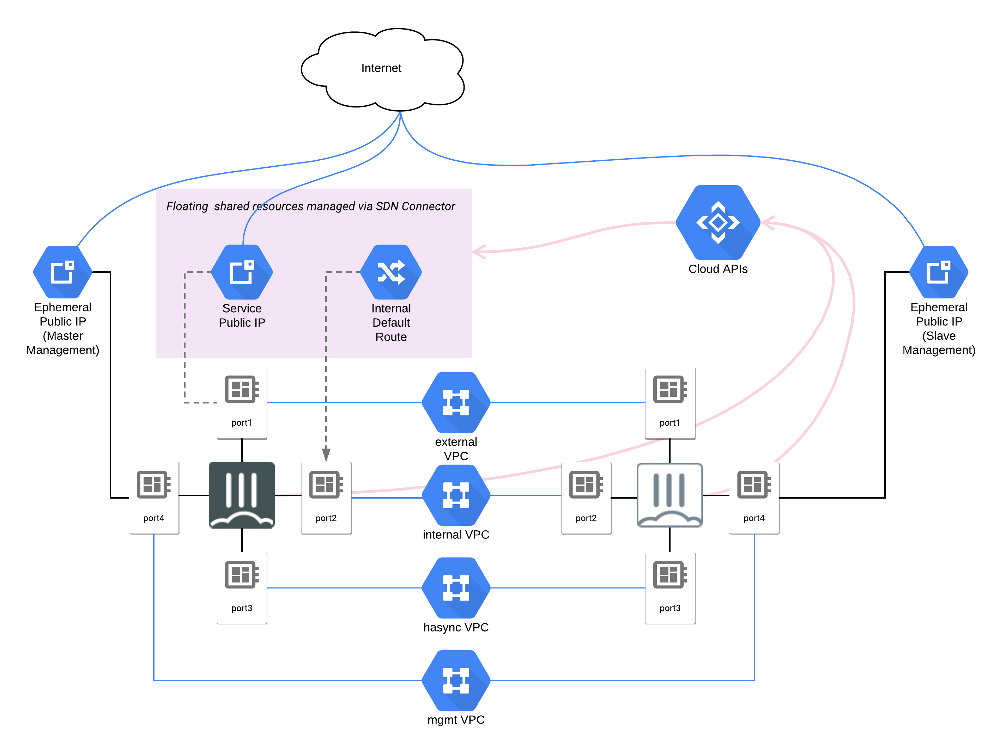

# HA Active-Passive

This example creates a HA Active-Passive configuration.

## Instances included in this Example

1. 4 VPC Networks
    - Public/External/Untrust
    - Private/Internal/Trust
    - Sync
    - Management
1. Subnets for each VPC Network
    - Public
    - Private
    - Sync
    - Management
1. Firewalls
    - Creates 'INGRESS' and 'EGRESS' rules allowing all protocols.
1. Route
    - Creates a route which has 'Next Hop IP' defined.
1. External/Static IP
1. 2 Instances
    - Active
        - Deploys License
        - Updates Password
        - Configures HA
        - Configures GCP SDN Connector
    - Passive
        - Deploys License
        - Updates Password
        - Configures HA
        - Configures GCP SDN Connector

## How do you run these examples?

1. Install [Terraform](https://www.terraform.io/).
1. Open `variables.tf`,  and fill in required variables that don't have a default. (CREDENTIALS, GCP_PROJECT, SERVICE_ACCOUNT_EMAIL, IMAGE, LICENSE_FILE)
1. Run `terraform get`.
1. Run `terraform init`.
1. Run `terraform plan`.
1. If the plan looks good, run `terraform apply`.
