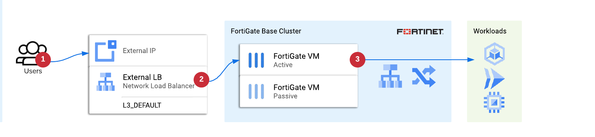
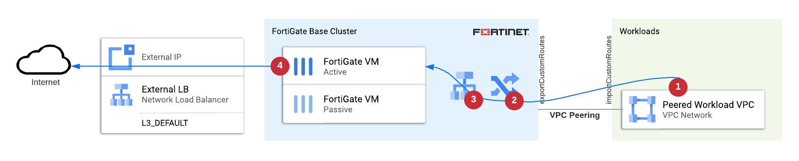
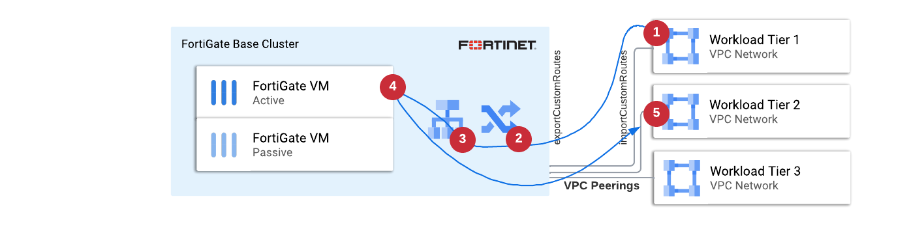

# FortiGate Reference Architecture for GCP

Reference architecture for FortiGate in GCP presents the recommended way to configure FortiGate VM instances and Google Cloud infrastructure. It is designed to cover most of the use-cases and will meet the requirements of most of the deployments. Note though, that in some cases a different architecture or some modifications might be required. If in doubt - please contact Fortinet cloud team for assistance at gcptech (at) fortinet.com

This part of the repository is use-case centric. It was created to help you match the configuration to the security functions you will use. Where possible use-cases are separated from the base FortiGate deployment. As different tools have different capabilities, this separation is implemented differently depending on the tool of your choice:
- *Terraform* - FortiOS provider allows creating, changing and destroying of FortiGate configuration "resources". You will find that all functionality is added after the deployment of the FortiGate instances as "Day 1" operations and can be changed/destroyed by applying a modified day1 configuration. This method provides maximum flexibility for Day n operations
- *Deployment Manager* - although Deployment Manager supports adding custom APIs, it is not a commonly used feature. DM templates in this repo deploy all functionality as part of Day 0 bootstrapping. Updating the DM deployment will NOT result in any changes to the FortiGate configuration.
- *gcloud* - deployment using Google Cloud CLI is provided as a large script. Parts of FortiGate configuration related to use-cases is added after the base deployment using SSH. Removing or changing of configuration is not part of the provided example script, but can be easily scripted by administrators.

### Shortcuts
* [Architecture](#architecture)
* [Supported Use-Cases](#supported-use-cases)
    - [Protecting public services (ingress N-S inspection)](#protecting-public-services-ingress-n-s-inspection)
    - [Secure NAT Gateway (outbound N-S inspection)](#secure-nat-gateway-outbound-n-s-inspection)
    - [Segmentation for multi-tier infrastructure (E-W inspection)](#segmentation-for-multi-tier-infrastructure-e-w-inspection)
    - [ Secure Hybrid Cloud (IPS for Interconnect)](#secure-hybrid-cloud-ips-for-interconnect)
    - [Private Service Connect](#private-service-connect)
    - [SD-WAN / Remote Access](#sd-wan--remote-access)
* [How to deploy](#how-to-deploy)

## Architecture
The recommended way to deploy FortiGates is a multi-AZ Active-Passive FGCP cluster with set of (up tp 3) load balancers to direct the traffic flows (a pattern known as "load balancer sandwich"):

[Read more about the reference architecture design and best practices](base.md)

## Supported use-cases
### Protecting public services (ingress N-S inspection)

FortiGate instances empowered by FortiGuard services can be used to secure your workloads running in the cloud against any bad actors accessing them from the Internet. Publishing your services via FortiGate allows you to not only scan traffic against malicious payload, but also provide granular access rules or enforce ZTNA policies.

To publish a service via FortiGate the following components are used:
- new public IP address and external network load balancer in GCP
- VIP and firewall policy in FortiGate
- internal load balancer and a static sutom route to handle return flow

Although the workloads could be deployed directly into trusted VPC, they are usually placed in separate VPC (often in a different project), which is peered with trusted. You can use simple or shared VPCs for hosting workloads.

### Secure NAT Gateway (outbound N-S inspection)

FortiGate is a great choice to replace the Cloud NAT service. You can easily regulate Internet access based on VM metadata and grant very selective access to services while adding AV scanning on top to make sure your workloads remain healthy.

To enable Internet access the following changes are added:
- internal load balancer as next-hop for the custom static route
- FortiGate IP Pool object and an outbound firewall policy
- (optionally) external load balancers and public IP addresses

ELB forwarding rules are used to bind public addresses to the FortiGate cluster, so you can specify in the FortiGate policy which public IP address should be used for a given type of traffic. Both external and internal load balancers are shared with the ingress north-south use-case.

### Segmentation for multi-tier infrastructure (E-W inspection)

East-west inspection in GCP can be provided only for traffic between VPC Networks (not inside a network), thus each security zone needs to be created as a separate VPC. Traffic between all workload VPCs properly peered to the FortiGate trusted VPC will be inspected by FortiGate VMs.

To enable east-west scanning use VPC peering with custom route export/import.

Note: The size of a single peering group is limited by GCP to 25 peers, but the number of supported security zones can be increased by adding more internal NICs to the FortiGate (effectively connecting it to multiple peering groups). Contact us if you need an architecture modification because of the number of security zones.

### Secure Hybrid Cloud (IPS for Interconnect)

When connecting your datacenters to the cloud using Interconnect you often need to enforce additional security controls between them. FortiGate high-throughput IPS engine as well as cloud metadata awareness is a great help in securing this internal perimeter.

To inspect traffic between on-prem available via Interconnect and the cloud you will use:
- custom route pointing to internal load balancer on the Interconnect side of the FortiGate
- custom route pointing to another internal load balancer for the cloud-to-onprem flow

### Private Service Connect

While migrating applications to the public cloud you might want to use PaaS services like Cloud SQL. Protecting access to your CloudSQL and making it available from both cloud and on-prem might seem challenging, but can be easily achieved using FortiGate Secure Services Hub.

This solution uses set of custom routes and load balancers to direct traffic from peered VPC Networks and from on-prem via FortiGate appliances in GCP just like in the segmentation use-case.

### SD-WAN / Remote Access

Providing access to remote users as well as from micro, small and large offices using VPN, SD-WAN or ZTNA technologies is one of the most common use-cases for FortiGates in the public cloud. This use-case follows the same setup as the Ingress N-S Inspection and does not have dedicated templates or deployment scripts.

## How To Deploy
* [using Terraform](terraform/)
* [using Deployment Manager](deployment-manager/)
* [using Google Cloud CLI](gcloud/)
