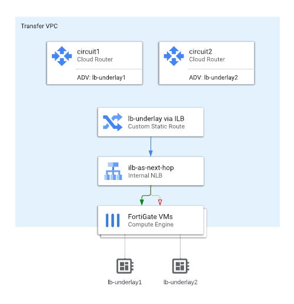

# SD-WAN over IC

This demo shows how to build redundant tunnels over 2 (fake) IC circuits leveraging BGP over FortiGate SD-WAN.

*Note: InterConnect is simulated using multiple VPN connections. From the VM perspective it doesn't make any difference as in both cases routes are learned by underlay BGP and injected by Cloud Routers into VPC routing table.

## Splitting IC

In a standard deployment all IC circuits are terminated in the same VPC and are advertising the same set of prefixes. This enables failover (by GCP) in case of circuit(s) failure. The recommended setup for production deployments is 4 circuits in 2 metros. In the demo scenario we have to break the recommendation in order to be able to steer traffic via a single designated circuit and offload circuit selection to FortiGate SD-WAN engine rather than GCP routing.

The easiest way to split the traffic is using 2 separate VPCs for 2 InterConnects. This approach is simple to implement, but requires an additional NIC on FortiGate which is not always desired. Additional NIC might cause increased cost or decreased performance due to the way of how driver queues are assigned by the hypervisor. An alternative approach presented here uses loopback interfaces and a custom route towards them via an ILB. Note that the "route-to-loopback" approach is not an official recommendation, but rather a GCP networking "trick".  

Note that splitting IC applies only to te cloud firewalls. We don't care in this demo about on-prem configuration.

## Remote site (on-prem)

Remote site (datacenter) in this demo is simulated using a simple 1-nic FortiGate deployment in GCP. This part is quick and dirty and you should not pay too much attention to it. It's a FortiGate. It is reachable using 2 different IP addresses over 2 different "InterConnect" links. It has a server you can use for testing/demos. That's al you need to know. In real world it will be a hardware FGT with a whole datacenter behind it.

## Overlay addresses

In dynamically routed networks you need addresses you can use as BGP peers. As in the case of SD-WAN setup we want to be able to create an abstraction layer for "physical" links / multiple tunnels we need to introduce and additional "overlay" network. The current way to implement it in FortiGates is using BGP-on-loopback pattern. This approach leverages several FortiGate functionalities:

* dedicated loopback interfaces are created for BGP peering. Each has a /32 IP address. We use addresses from the same subnet to make it easier, but you could use any random address (but don't, mess does not help)
* exchange-interface-ip IKE extension is used to advertise and learn peer's loopback address. Neither the tunnel interface nor sdwan interface are used to host the overlay address. The same loopback address is used by both tunnels which abstracts the SD-WAN zone from BGP routing.

This configuration applies to both cloud and on-prem FortiGates.

## Failovers

### Link failure

Link failure is detected by both sides of the connection using SD-WAN SLA health-checks (in this demo setup we actively ping overlay addresses). SD-WAN would steer traffic via alternative link without dropping any connections. FEC can be additionally used to increase reliability

### NVA failure

In case of inavailability of the primary cloud FortiGate a standard failover procedure will take place:
1. internal pass-through network load balancer will detect change in the healthy backends set using health-check probes
2. existing tunnels will be redirected to the secondary NVA
3. thanks to FGCP secondary will resume the tunnels and all connections within
4. thanks to route-ttl the BGP routes will be kept in the kernel table for some time
5. BGP peering will be re-established by secondary NVA using the same IP addresses (loopback overlay)

## Demo flow

### Intro

1. fill in flex tokens in terraform.tfvars, set GOOGLE_PROJECT environment (if not running on cloud shell), update prefix
1. deploy template
1. give yourself a minute for the bootstrap to complete (you can check the serial console output for FGT1 in the meantime)
1. connect to cloud fgt1 web UI
1. go to Network > SD-WAN > Performance SLAs, explain topology about 2 ipsec links "aggregated" using sdwan. One tunnel has better latency, one worse.

###SD-WAN

1. connect to server on cloud side using SSH (use cloud console)
1. ssh to 10.0.200.2 (server on prem)
1. ping back to 10.0.100.2 (server in cloud)
1. add an SD-WAN rule leveraging bgp_ping SLA latency
1. pings are now using better latency link

HA

1. now you have pings for measuring lost packets AND a long-running ssh session going through the sd-wan link
1. stop primary FGT in cloud
1. your ssh session will stall for ~10 seconds and resume afterwards - this proves the failover time and that it is stateful
1. note that you might get a slower ping or two (~180ms vs 3ms) - this is because for demo you have one low-latency and one high-latency tunnel (jumping across ocean). If you do see a slower ping it additionally demonstrate how FortiGates smoothly move connections between SD-WAN members based on detected health.

Unerlay failure

1. make sure you have the pings from remote to cloud running
1. go to cloud console > VPN
1. find your tunnels by prefix and identify the two with *-gw-remote1 Cloud VPN gateway (yes, 2. I'm using a module building pairs of tunnels, so we're actually emulating 2 IC links using 4 tunnels. Doesn't matter for the demo)
1. mark and delete those 2 tunnels
1. switch back to the shell view with pings and observe how (without losing one) they started to show worse latency
1. connect to cloud fgt2 (now active) and show SD-WAN performance SLA bgp_ping which indicates that one sdwan member is down so if switched the traffic to the other one.

Done

1. don't forget to terraform destroy